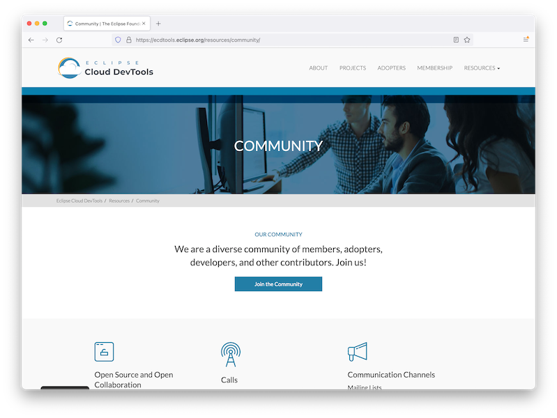

+++
date = "2021-10-08"
title = "Cloud DevTools Community Update - October 2021"
headline = "Cloud DevTools Community Update - October 2021"
summary = "In this post we talk about the latest happenings in the Cloud DevTools community. Included is information about our new website design, upcoming events, project updates, the Embedded SIG, our developer survey, and more."
category = "blog"
+++
# About Us
The [Eclipse Cloud DevTools Working Group](https://ecdtools.eclipse.org/) provides a vendor-neutral ecosystem of open-source projects focused on defining, implementing and promoting best-in-class web and cloud-based development tools. This working group accelerates innovation and adoption of Cloud Integrated Development Environment (IDE) and container-based workspace management technologies.

## Membership
We are a diverse group of members, consisting of both large and small organizations, all working in different domains to provide best-in-class solutions for their developers. In 2021 we have welcomed three new members already, Arm, STMicroelectronics, and Renesas. They are spearheading working group efforts to build tools in and for the cloud in the field of embedded development.

Learn more about the working group by reading about our [members](https://ecdtools.eclipse.org/membership), our [projects](https://ecdtools.eclipse.org/projects), and our [FAQs](https://ecdtools.eclipse.org/about/). For questions about Working Group membership, complete [this form](https://accounts.eclipse.org/contact/membership/ecdtools).

# Website
We recently completed a major overhaul of the working group website: [https://ecdtools.eclipse.org](https://ecdtools.eclipse.org). This new resource is designed to be more visually appealing, easier to navigate, and a platform that better highlights and drives traffic to our projects.  Accompanying the website is the launch of our new logo. Both were collaborations of designers, the foundation team, and the working group members. We’re very happy with the results. If you find anything that seems out of place, or have ideas for further content, please [open a Github issue](https://github.com/EclipseFdn/ecdtools.eclipse.org/issues).

# Events
It’s event season and we are participating in a number of upcoming virtual and live events. Here’s a quick overview:

## CN4EF Day at KubeCon + CloudNativeCon NA
Cloud Native for Eclipse Foundation (CN4EF) Day 2021 is a full-day of expert talks, demos, and thought-provoking sessions focused on enterprise applications implemented using Eclipse Foundation projects on Kubernetes -- from the cloud and all the way to the edge. The Eclipse Cloud DevTools, Jakarta EE, MicroProfile, and Eclipse Edge Native communities will all be represented. CN4CF Day is co-located with KubeCon / CloudNativeCon North America 2021. [Sign up](https://events.eclipse.org/2021/cn4ef-day/)!

Be sure to drop by our booth as well at the [main conference](https://events.linuxfoundation.org/kubecon-cloudnativecon-north-america/).

## EclipseCon
EclipseCon is the leading conference for developers, architects, and open source business leaders to learn about Eclipse technologies, share best practices, and more. Join us at the event to learn more about common challenges and innovate together on open source runtimes, tools, frameworks  and much more! [Register today](https://www.eclipsecon.org/2021/registration). Read more about the Web and Desktop Tools & IDEs track in [this blog post](https://blogs.eclipse.org/post/hailley-seed/don%E2%80%99t-miss-these-talks-about-web-and-desktop-tools-ides-eclipsecon-2021).

Like last year, we are having a virtual [Community Day](https://www.eclipsecon.org/2021/community-day) before the main conference, on October 25. Come and join our [Cloud DevTools session](https://www.eclipsecon.org/2021/eclipse-cloud-devtools-community-day), which is extended to 2.5 hours this year.

## Open Source Experience (OSXP)
The goal of [Open Source Experience](https://www.opensource-experience.com/en/) is to bring together the entire open source expert community for two days for a new dynamic in a sector that is constantly innovating. On-site this year in Paris and with a focus on European open source, the Eclipse Foundation is delighted to be participating. You can visit our booth throughout, and our session titled ‘*Open-Source Tools and Platforms: From the Cloud to the Edge and Beyond*’ will focus on why open source enables innovation at an industrial scale.

## TheiaCon

Save the date! The annual TheiaCon 2021 will be taking place starting November 17th, 2021. Join us to get to know the community, learn about the latest developments, and share your ideas live with Theia ecosystem leaders and innovators.

[Register now](https://events.eclipse.org/2021/theiacon/) to hear from Theia developers, adopters, and other contributors.

## Cloud Chat and Cloud Tool Time
Both of our Cloud DevTools event series continue to gain momentum. Check out the latest episodes and follow our channels here:

- [Cloud Tool Time](https://www.youtube.com/playlist?list=PLy7t4z5SYNaSBxx8gLh0i9LlN2bZW6H1L)
- [Cloud Chat](https://www.twitch.tv/cloudchat_)

We’re also in the process of booking 2022 episodes of both of these series. Be sure to sign up to share your projects, ideas and tips with the community.

- [Cloud Tool Time Sign up](https://docs.google.com/forms/d/e/1FAIpQLScudzvlUVfXehmz-Jkivv_BkJdljSjtZLENkT16jSxTzwzwkQ/viewform?usp=sf_link)
- [Cloud Chat Sign up](https://docs.google.com/forms/d/e/1FAIpQLSdnERYGVMow4RV9AE4F3h_r6nfFambOY2Cg_mGaykDZ08yoiw/viewform?usp=sf_link)

# Projects
## Che
Eclipse Che 7.36 and 7.37 were released last month. With those releases we have made Che simpler to manage, dropping [single user support](https://github.com/eclipse/che/issues/20314) and simpler to use with the introduction of [JetBrains Projector-based Che editors](https://github.com/eclipse/che/issues/19596) and the use of [multi-root project layout by default in the Che-Theia editor](https://github.com/eclipse/che/issues/19199). We made it easier to reduce workspaces startup time using the Kubernetes Image Puller as it’s now [automatically configured to pull the container images used by the current installation of Che](https://github.com/eclipse/che/issues/19657). Finally we improved the integration with Kubernetes completing [part 2 of DevWorkspace Operator](https://github.com/eclipse/che/milestone/139) integration in Che (including the support for v2 of the Devfile spec) and [backup automation](https://github.com/eclipse/che/issues/19932) when upgrading Che.

## Dirigible
Eclipse Dirigible [6.0.0](https://www.dirigible.io/releases/2021/09/29/news-new-release-6-0/) has been released in September 2021. New form based editors added for CSV files management in the context of data import. Lots of improvements and fixes in the OData layer have been made - entity references, event handlers and more. For the static content/resources mainly for the client side frameworks, has been adopted the corresponding versions of WebJars. The first version of the Spring Boot distribution package is part of the current version as well.

## JKube
Eclipse JKube [1.5.0](https://github.com/eclipse/jkube/milestone/11) will be released during October 2021. Among the main highlights, the new Kubernetes and OpenShift Gradle plugins will be available for preview. If you want to learn more and see the new plugins in action, register for the [JKube session on EclipseCon 2021](https://www.eclipsecon.org/2021/sessions/containerize-and-deploy-kubernetes-your-gradle-java-project-eclipse-jkube) where we will unveil them.

## Open VSX
The public [open-vsx.org](https://open-vsx.org/) service is continuing to gain adoption both from users and publishers. The registry now has more than 1300 high-quality extensions, which are accessed daily by communities around VSCodium, Gitpod and many Theia-based applications. Contributions to the project code, on the other hand, have been rather low for some time. But the development of the Open VSX server application started to pick up speed again as we welcomed two new committers to the project: Aart van Baren and Anton Kosyakov. The main focus is on getting the project ready for the high load it is already experiencing and the even higher demand we foresee moving forward.

## Theia
Eclipse Theia 1.18.0 was released at the end of September. It contains miscellaneous enhancements and bugfixes. Notably, the supported VS Code extensions API was stepped from 1.50.0 to 1.53.2, which permits consuming later versions of many popular extensions that were already available on open-vsx.org but could not yet be used in Theia-based applications. See the [changelog](https://github.com/eclipse-theia/theia/blob/master/CHANGELOG.md#v1180---9302021) for details. Around the same time, [Theia Blueprint Beta 2](https://eclipsesource.com/blogs/2021/09/27/eclipse-theia-blueprint-beta-2-is-released/) was released. For the first time, it bundles the full set of VS Code “built-in” extensions. If you have a previous version installed, you can use the auto-update feature to get the latest, else you can download the package for your operating system [here](https://theia-ide.org/docs/blueprint_download).

# Embedded Special Interest Group
Embedded tools vendors are at different stages of their journey to the cloud. Many will remain invested in other platforms, for example the Eclipse IDE, while they look to move to the cloud. Some are leading the way. Arm have built their Mbed Studio on Eclipse Theia, and recently moved in-browser with Keil Studio.

Here are the high-level goals of the SIG:

- Facilitate collaboration to encourage deeper cooperation between embedded tools vendors
- Develop and promote technical standards that benefit all tools
- Drive innovation in the ecosystem
- Accelerate the move from traditional desktop tools for embedded development to platforms built on Web technologies for in-browser cloud-hosted or desktop dev tools
- Strengthen and diversify the project ecosystem. Identify and fill gaps in the Eclipse Cloud DevTools project portfolio.
- Grow the Cloud DevTools community
- Align project priorities to support SIG objectives

Technical initiatives that have bubbled up as priorities include publishing a report on C++ tooling on the Web (think CDT for the Web built on top of Theia), [Memory Inspector](https://blogs.eclipse.org/post/brian-king/memory-inspector-debugger-theia), porting [Trace Compass](https://www.eclipse.org/tracecompass/) to the Web, Multiple Contexts for indexes in clangd, and the [Eclipse CDT GDB Adapter](https://github.com/eclipse-cdt/cdt-gdb-adapter).

Current members of the group are Arm, EclipseSource, Ericsson, Renesas, and STMicroelectronics. If you are interested in joining, [let us know](https://forms.gle/2mzFBqhB3AscjkPMA).

# Developer Survey
Next week we will be launching our first annual Cloud Developer Survey Results. This independently New Cloud Native Research Offers Insights into Developer Trends, This report was commissioned by the Eclipse Cloud DevTools Working Group and is the result of more than 300 interviews conducted by an independent analyst organization. Participants consisted of software developers, as well as DevOps, IT and development leadership. Primary survey objectives were to gain a better understanding of cloud-based developer trends by identifying the requirements, priorities, and challenges faced by organizations that deploy and use cloud-based development solutions, including those based on open source technologies.

Keep an eye out for this insightful report!  

# Get Involved
The Cloud DevTools community is growing faster than ever. and there are many ways to both contribute and stay informed.

- Join the [community mailing list](https://accounts.eclipse.org/mailing-list/ecd-tools-wg) (an Eclipse account is required)
- For instant messaging, we use Slack and you can join at [ecd-tools.slack.com](https://join.slack.com/t/ecd-tools/shared_invite/zt-wwlyxxye-jJUXWoLaVSbPE4il8D1Nuw).
- Get social with us on Twitter [@ECDTools](https://twitter.com/ECDTools) and on [LinkedIn](https://www.linkedin.com/showcase/ecd-tools/)
  - Use #CloudDevTools and #ECDtools hashtags whenever relevant in your posts 
  - Ask your company’s social media team to follow and retweet from official handles
  - Please share news and updates with your own personal networks
- Author blog posts that mention Cloud DevTools or related projects
  - Write a post about your experience as a member of the community
- [Fill out this handy form](https://docs.google.com/forms/d/e/1FAIpQLSeUxVsVRWT0xSsw2jyIwzYRlZvPiFPq8jCyrDICY-fnT2MF5w/viewform) to share your case studies and success stories with us
- Submit talks to conference CFPs for Cloud DevTools awareness
- Add our community calendar to your calendar to hear about upcoming events. More details on how to subscribe are on our [community page](https://ecdtools.eclipse.org/resources/community/).
