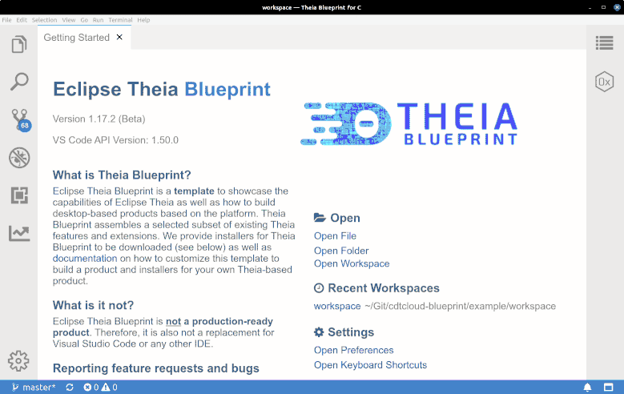
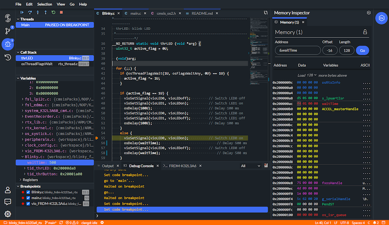
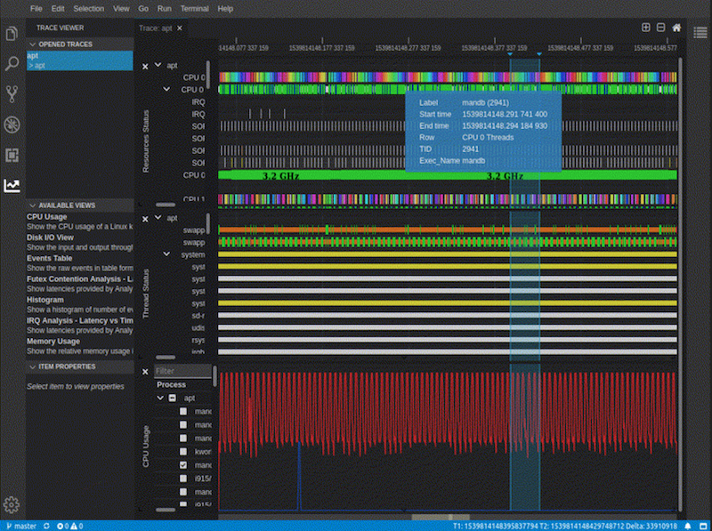

+++
date = "2021-11-02"
title = "Moving Embedded Software Development Tools into the Cloud"
headline = "Moving Embedded Software Development Tools into the Cloud"
summary = "In this article, we introduce the embedded special interest group (embedded SIG), hosted by the Eclipse Foundation. The embedded SIG is an open collaboration of embedded vendors and service providers, with the goal of strengthening the open source ecosystem for building web- and cloud-based tools used for embedded development. The SIG provides the structure for participants to coordinate efforts, share insights and collaborate on technical initiatives and standards."
category = "blog"
+++
In this article, we introduce the embedded special interest group (embedded SIG), hosted by the Eclipse Foundation. The embedded SIG is an open collaboration of embedded vendors and service providers, with the goal of strengthening the open source ecosystem for building web- and cloud-based tools used for embedded development. The SIG provides the structure for participants to coordinate efforts, share insights and collaborate on technical initiatives and standards.

The Eclipse Foundation has a strong track-record with embedded tools, in particular with the [Eclipse CDT](https://www.eclipse.org/cdt/) project. In recent years, many adopters of CDT are striving towards web and cloud-based tools. “We can observe a trend in our customer base that the embedded domain  leads the way in terms of adopting modern tool technologies,” says Jonas Helming from [EclipseSource](https://eclipsesource.com/technology/c-c-tooling/). “This is great for the ecosystem, because many of these embedded vendors are migrating from the CDT ecosystem; they are experienced in adopting open source technology and they are traditionally strong contributors”.

The move by the Eclipse Cloud DevTools Working Group to setup the embedded SIG and to support tools in the cloud in this domain, is driven by trends we are seeing in the market. Because of this, we, along with our members, are motivated to accelerate the adoption of cloud-based embedded tools. Current members of the group include [Arm](https://www.arm.com/), [EclipseSource](https://eclipsesource.com/), [Ericsson](https://www.ericsson.com/en), [Renesas](https://www.renesas.com/), and [STMicroelectronics](https://www.st.com/content/st_com/en.html). If you are interested in joining, let us know. The group meets monthly to determine priorities, assign tasks, and work through technical initiatives. Let’s now look at some selected initiatives to get an overview of what the SIG is all about.

# Technical Initiatives
All embedded SIG technical initiatives are defined using a collaborative process. Each member can suggest topics. If other members are interested in a particular topic, joint initiatives are then started. While there is typically a subset of members working on a specific topic, any progress and results are discussed and shared with the entire group.

## CDT.cloud Blueprint
This initiative is led by EclipseSource and aims at providing guidelines for the technology selection when creating web-based C/C++ tools. On the desktop, CDT provided a very good basis for building custom tools. Achieving similar results in the web/cloud typically requires the selection and integration of various technologies from different sources. To address this, EclipseSource has conducted a survey among the members of the SIG and also within their customer base to find out which technologies are most frequently adopted (e.g. language servers, debug adapters, VS Code extensions, etc.).



CDT.cloud Blueprint



Based on feedback received, they are assembling a blueprint tool (similar to Eclipse Theia Blueprint), called CDT.cloud Blueprint. It provides an excellent demonstration of how to build web-based C/C++ tools. Even more, it can be used as a starting point to create a custom tool distribution. Check out [https://cdt-cloud.io](https://cdt-cloud.io/) to download the blueprint, and please make sure to provide feedback!

## Memory Inspector
One of many components needed for a good C/C++ tool in the web/cloud is a way to inspect the memory in detail, while debugging a program. The memory inspector adds useful functionality for inspecting memory during debugging, including: dynamic updating of memory, multiple memory views, view comparison (diffing), and register viewing. This initiative is led and contributed by Ericsson. Arm and other members are evaluating, providing feedback and adopting the result.



Memory Inspector in Arm Keil Studio



To follow along with the work being done to integrate this into Eclipse Theia, have a look at [the repository on GitHub](https://github.com/theia-ide/theia-trace-extension/). More information can be found in [this blog post](https://blogs.eclipse.org/post/brian-king/memory-inspector-debugger-theia).

## TraceCompass
Eclipse TraceCompass is a popular open source application to solve performance and reliability issues by reading and analyzing [traces](https://en.wikipedia.org/wiki/Tracing_(software)) and [logs](https://en.wikipedia.org/wiki/Logfile) of a system. Its goal is to provide views, graphs, metrics, and more to help extract useful information from traces, in a way that is more user-friendly and informative than huge text dumps.



Trace Compass in action (click image for animation)



As an initiative of the embedded SIG, TraceCompass is currently being migrated to a web-based interface and to run as a distributed cloud-based application. It is also led and contributed by Ericsson, while other parties are evaluating it for adoption.
Again, to follow along with the work being done to integrate TraceCompass into Eclipse Theia, see [this pull request](https://github.com/eclipse-theia/theia-cpp-extensions/pull/119). For more information, please follow this link: [https://www.eclipse.org/tracecompass/](https://www.eclipse.org/tracecompass/). 

## Multiple Contexts for indexes in clangd
Most vendors use clangd as a C/C++ language server. It offers a convenient option for enabling source code editing on the web. One missing piece, however, is the notion of a “context” in terms of source files considered by the language server. As an example, you might have multiple projects in a workspace, the language server should consider them independently. On this initiative, several members are currently collaborating. Ericsson contributed their solution, allowing to start multiple language servers per workspace. STMicroelectronics, in collaboration with EclipseSource, is working on a mechanism to dynamically specify and switch the context of a running clangd language server. Such a solution would even allow different language processing depending on the current build target (e.g. for debugging or release). Stay tuned for more information about this ongoing initiative!

## CDT GDB Adapter
The [Eclipse CDT GDB Adapter](https://github.com/eclipse-cdt/cdt-gdb-adapter) is an implementation of the [Debug Adapter Protocol](https://microsoft.github.io/debug-adapter-protocol/) (DAP), allowing the connection of web-based tools to any device supporting GDB. The library provided by CDT can be included into VS Code, Theia or any client that supports DAP. For example, Renesas, ARM and Blackberry/QNX all have VS Code or Theia extensions that can allow the IDE to connect to their respective hardware and ecosystem. Whether your editor is a traditional IDE, or you are using the new generation of editors in the cloud, the adapter is a key piece that allows communication between that editor and GDB.

In addition to the third-party adapters that are built on top of CDT GDB Adapter, the adapter is also delivered as an extension for Theia via the [Open VSX Registry](https://open-vsx.org/extension/eclipse-cdt/cdt-gdb-vscode). The embedded SIG is also making plans to deliver the adapter as an extension for VS Code in the near future.

# Conclusion
Embedded tool vendors are at different stages of their journey to the cloud. Many of them still remain invested in legacy platforms, including the Eclipse IDE. However, embedded vendors are currently also leading the way towards web and cloud-based tools. Arm, as an example, have built their Mbed Studio based on Eclipse Theia, and recently moved in-browser with [Keil Studio](https://www.keil.arm.com/). The embedded special interest group is a great place to collaborate on this innovative ecosystem, share experiences and drive technical initiatives. If you are interested in learning more about or joining this group, please contact us [here](https://forms.gle/2mzFBqhB3AscjkPMA).
