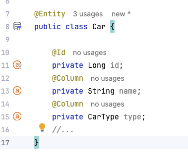

We’re thrilled to announce the **final release of Jakarta NoSQL 1.0**, a brand-new specification designed to bring standardization, productivity, and portability to NoSQL integration in the Java ecosystem.

This release marks a significant step in the Jakarta EE platform by introducing the **first-ever NoSQL specification**. Whether you’re working with document, key-value, column, or graph databases, Jakarta NoSQL is built to streamline your development experience.

## Why Jakarta NoSQL?

Jakarta NoSQL was created to make it easier and more productive for developers to work with NoSQL databases while staying fully within the Jakarta EE programming model. It brings:

*   **Increased productivity** for everyday NoSQL operations
*   **Rich object mapping** between Java classes and NoSQL documents or records
*   **Java-based querying** using a **fluent and expressive API**
*   A flexible architecture designed to support **various NoSQL types and behaviors**
*   Annotation-driven development using **Jakarta Persistence-like annotations** for a familiar developer experience


## Familiar Annotations for a Familiar Model

Jakarta NoSQL follows a convention-over-configuration approach with annotations that mirror the Jakarta Persistence (JPA) model where possible. If you’ve worked with JPA, these will feel instantly recognizable:

Here’s a quick example:


|Annotation | Purpose |
| -------- | ------- |
|@Entity|Defines a class as a persistable entity|
|@Id|Marks the primary key of an entity|
|@Column|Maps a property or field to a database column|
|@MappedSuperclass|Shares mappings with subclasses|
|@Embeddable|Defines an embeddable value object|
|@Inheritance, @DiscriminatorColumn, @DiscriminatorValue|Enables inheritance strategies|
|@Convert|Handles type conversion for persistence|

```java
@Entity
public class Car {
    @Id
    private Long id;

    @Column
    private String name;

    @Column
    private CarType type;
}
```

While the spec intentionally avoids defining relationships like `@OneToMany` or `@ManyToOne` due to the nature of most NoSQL databases, it leaves room for database-specific extensions, empowering vendors to offer support where applicable.

## The Template Interface: The Bridge Between Java and NoSQL

At the core of Jakarta NoSQL is the `Template` interface, a powerful abstraction that connects annotated Java entities with NoSQL databases. It supports standard CRUD operations and fluent queries, all through a type-safe API.

```java
@Inject
Template template;

Car ferrari = Car.id(1L).name("Ferrari").type(CarType.SPORT);
template.insert(ferrari);

Optional<Car> car = template.find(Car.class, 1L);
template.delete(Car.class, 1L);
```

Beyond basic persistence, you can use fluent-style queries for more advanced operations:

```java
List<Car> cars = template.select(Car.class)
.where("type").eq(CarType.SUV)
.orderBy("name").asc()
.result();

template.delete(Car.class)
.where("type").eq(CarType.COUPE)
.execute();
```

This API gives developers powerful, type-safe tools for interacting with NoSQL data — and extensibility is built in. Vendors can extend the Template interface to provide native capabilities specific to their NoSQL solution.


****

## Tooling Support and Implementation


Jakarta NoSQL is already supported by Eclipse JNoSQL, the reference implementation that brings:

* Full support for **CDI** and **CDI Lite**
* A Java **Annotation Processor** to avoid runtime reflection
* Integration with IntelliJ IDEA, allowing real-time identification of persistable fields and entities  




Jakarta NoSQL is more than just another data access API — it’s the beginning of a new chapter for Java developers working with modern data systems. Its focus on extensibility, productivity, and alignment with Jakarta EE principles opens the door to a unified, portable, and future-proof way to work with NoSQL technologies.

Jakarta NoSQL is ready to simplify your data layer, whether you're building microservices, event-driven applications, or cloud-native systems.

Learn more at: [https://jakarta.ee/specifications/nosql/1.0/](https://jakarta.ee/specifications/nosql/1.0/)
