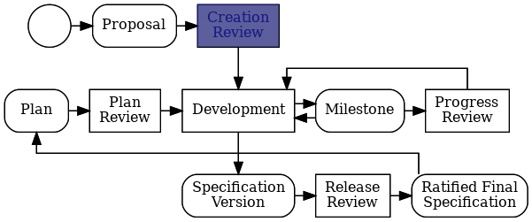
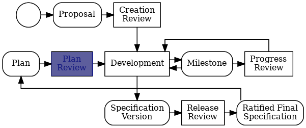
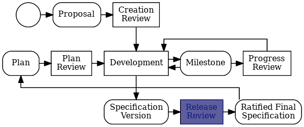

## Content

- [はじめに]()
- [Creationレビュー]()
- [Planレビュー]()
- [Releaseレビュー]()
- [サービスリリース]()
- [Progressレビュー]() *(任意)*

## はじめに {#intro}

このガイドは、Jakarta EE仕様プロセスの開発者がJakarta EE仕様プロセス（[JESP](https://jakarta.ee/ja/about/jesp/)）のステップをナビゲートするのに役立つステップバイステップの実用的なガイドです。 

便利ツールとして提供するものですので、**疑問がある場合は、必ず[JESP](https://jakarta.ee/ja/about/jesp/)を参照してください**。 Jakarta EE仕様の開発に関するご質問・ご意見等ございましたら、[仕様委員会](mailto:jakarta.ee-spec@eclipse.org)まで、お気軽にお問い合わせください。[JESP](https://jakarta.ee/ja/about/jesp/)は、Eclipse仕様プロセス（[EFSP](https://www.eclipse.org/projects/efsp/)）を採用しています。

This diagram is the Eclipse Specification Version Lifecycle.  It shows the steps to create and evolve a Specification.

The most important kind of step in the lifecycle is the **Review** step. A Review is an event that takes place over a week or two of calendar time. The team developing a Specification creates some kind of artifact and submits it to the Specification Committee for review. The Specifiation Committee has a short amount of time to review the submitted artifact and conduct a ballot among its members to approve or not-approve that artifact under review. This guide contains a sufficient explanation of Review, but if you want the full definition, see the [Eclipse Foundation Specification Process](https://www.eclipse.org/projects/efsp/?version=1.3#efsp-reviews) and the [Eclipse Foundation Development Process](https://www.eclipse.org/projects/dev_process/#6_3_Reviews).

The remainder of this guide explains the different kinds of Review steps, and the steps you need to take for each one.

## Creationレビュー {#creation}

* Jakarta仕様プロジェクトは、Eclipse開発プロセス（[EDP](https://www.eclipse.org/projects/dev_process/)）で定義されるプロジェクトとは違うプロジェクトとして作成されます。
* Jakarta仕様プロジェクトは、仕様策定委員会の承認を受ける必要があります。
* 詳しくは、EFSPの[Creationレビュー](https://www.eclipse.org/projects/efsp/#efsp-reviews-creation)を参照してください。

### 必要なステップ

1. プロジェクト提案(*)を作成します。
2. **[Creationレビューテンプレート](https://github.com/jakartaee/specifications/blob/master/.github/PULL_REQUEST_TEMPLATE/creation_review_pr_template.md)** を使用して、[Jakarta EE仕様リポジトリ](https://github.com/jakartaee/specifications)にプルリクエストを送信します。
3. [仕様策定委員会](mailto:jakarta.ee-spec@eclipse.org)にメールを送信し、Creationレビューをリクエストします。
4. Creationレビューが正常に完了するまで待ってから、次に進みます。

(*) プロジェクトの作成を進める前に、仕様策定委員会とアイディアを共有して、サポートを求めることをお勧めします。

## Planレビュー {#plan}

* 各仕様プロジェクトは、新しい仕様のメジャーバージョンまたはマイナーバージョンのサポートに関する広範な開発作業の前に、Planレビューを行う必要があります。 
* Planレビューは、[サービスリリース]()では必要ありません。
* 詳しくは、EFSPの[Planレビュー](https://www.eclipse.org/projects/efsp/#efsp-reviews-plan)を参照してください。

### 必要なステップ

1. **[Planレビューテンプレート](https://github.com/jakartaee/specifications/blob/master/.github/PULL_REQUEST_TEMPLATE/plan_review_pr_template.md)** を使用して、[Jakarta EE仕様レポジトリ](https://github.com/jakartaee/specifications)にプルリクエストを送信します。
2. [仕様策定委員会](mailto:jakarta.ee-spec@eclipse.org)にメールを送信し、Planレビューをリクエストします。
3. Planレビューが正常に完了するまで待ってから、次に進みます。

## Releaseレビュー {#release}

* 仕様の最終版は、（対応する仕様策定委員会からの圧倒的多数の承認を含む）Releaseレビューに成功するまで、一般に公開できません。
* 詳しくは、EFSPの[Releaseレビュー](https://www.eclipse.org/projects/efsp/#efsp-reviews-release)を参照してください。

### 必要なステップ

1. **[Releaseレビュー テンプレート](https://github.com/jakartaee/specifications)** を使用して、[Jakarta EE仕様リポジトリ](https://github.com/jakartaee/specifications/blob/master/.github/PULL_REQUEST_TEMPLATE/pull_request_template.md)にプルリクエストを送信します。
2. [仕様策定委員会](mailto:jakarta.ee-spec@eclipse.org)にメールを送信し、Releaseレビューをリクエストします。
3. Releaseレビューが正常に完了するまで待ってから、次に進みます。

## サービスリリース {#service}

* 「サービスリリース」のJESP定義に従う限り、仕様サービスリリース（x.y.z）に対して正式なRelease レビューは必要ありません。
* つまり、サービスリリースでは機能の変更やIP範囲の拡大は許可されません。 
* [サービスリリース](https://www.eclipse.org/projects/efsp/#efsp-releases-service)の詳細については、EFSPおよび[JESP](https://jakarta.ee/ja/about/jesp/)を参照してください。

### 必要なステップ

1. **[サービスリリーステンプレート](https://github.com/jakartaee/specifications/blob/master/.github/PULL_REQUEST_TEMPLATE/service_release_pr_template.md)** を使用して、[Jakarta EE仕様リポジトリ](https://github.com/jakartaee/specifications) にプルリクエストを送信します。
2. [仕様策定委員会](mailto:jakarta.ee-spec@eclipse.org)にメールを送信し、PRのレビューの準備ができたことを知らせます。
3. PRの承認とマージを待ってから続行します。

## Progressレビュー {#progress}

* ProgressレビューはJESPの通常のフロー（*creation->plan->release->plan->release->plan->release* など）の一部ではありません。
* Progressレビューは、仕様策定委員会に進捗状況を知らせたいが、まだリリースの準備ができていないときに、プロジェクトによって開始できます。
* 12か月以内に進捗がない場合は、仕様策定委員会がProgressレビューをリクエストすることができます。
* 詳しくは、EFSPの[Progressレビュー](https://www.eclipse.org/projects/efsp/#efsp-reviews-progress)を参照してください。

### 必要なステップ

1. **[Progressレビューテンプレート](https://github.com/jakartaee/specifications/blob/master/.github/PULL_REQUEST_TEMPLATE/progress_review_pr_template.md)** を使用して、[Jakarta EE仕様リポジトリ](https://github.com/jakartaee/specifications)にプルリクエストを送信します。
2. [仕様策定委員会](mailto:jakarta.ee-spec@eclipse.org)にメールを送信し、Planレビューをリクエストします。
3. Progressレビューが正常に完了するまで待ってから、次に進みます。
