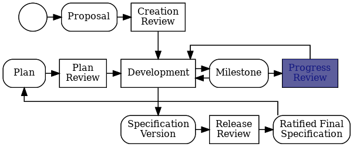

## 内容

- [介绍]()
- [创建评论]()
- [计划评审]()
- [版本评审]()
- [服务版本]()
- [进度评审 ]() *(可选)*

## 介绍 {#intro}

本指南是一份循序渐进的实用指南，旨在帮助Jakarta EE规范项目的开发人员了解Jakarta EE规范过程的各个步骤([JESP](https://jakarta.ee/about/jesp/)). 
本指南旨在提供一份有用的工具，所以 **如有任何疑问，请直接移步 [JESP](https://jakarta.ee/about/jesp/) 了解完整内容**
如果您对 Jakarta EE 规范的开发有任何疑问或意见，不要犹豫，请直接联系 [Specification Committee](mailto:jakarta.ee-spec@eclipse.org) 
[JESP](https://jakarta.ee/about/jesp/) 遵循 Eclipse 规范过程 ([EFSP](https://www.eclipse.org/projects/efsp/)).

## 创建评论 {#creation}

* Jakarta 规范项目的创建方式与 Eclipse Development Process ([EDP](https://www.eclipse.org/projects/dev_process/)) 的其他项目一致.
* Jakarta 规范项目必须经由规范委员会许可.
* [点击此处](https://www.eclipse.org/projects/efsp/#efsp-reviews-creation) 了解如何在 EFSP 中创建评论.

### 相关步骤

1. 创建项目建议书 (*).
2. 使用 **[评论创建模板](https://github.com/jakartaee/specifications/blob/master/.github/PULL_REQUEST_TEMPLATE/creation_review_pr_template.md)**，向 [Jakarta EE 规范代码仓库](https://github.com/jakartaee/specifications) 提交PR.
3. 向 [规范委员会](mailto:jakarta.ee-spec@eclipse.org) 发送邮件以请求创建评审.
4. 请等待创建评审成功，然后继续后续步骤.

(*) 在继续创建项目之前，与规范委员会交流这个想法以寻求支持可能是个好主意.

## 计划评审  {#plan}

* 在对**新规范的主版本或副版本**进行大规模开发工作之前，每个规范项目都需要进行**计划评审**. 
* [服务版本]()不需要进行计划评审.
* 了解EFSP中关于 [计划评审](https://www.eclipse.org/projects/efsp/#efsp-reviews-plan) 的更多内容.

### 相关步骤

1. 使用 **[计划评审模板](https://github.com/jakartaee/specifications/blob/master/.github/PULL_REQUEST_TEMPLATE/plan_review_pr_template.md)**，在[Jakarta EE 规范代码仓库](https://github.com/jakartaee/specifications) 中提交PR
2. 向 [规范委员会](mailto:jakarta.ee-spec@eclipse.org) 发送邮件以请求创建评审.
3. 请等待创建评审成功，然后继续后续步骤.

## 版本评审 {#release}

* 规范的最终版本只有在进行了成功的版本评审之后(得到规范委员会相应的绝对多数批准)才能普遍使用..
* 了解EFSP中关于 [版本评审](https://www.eclipse.org/projects/efsp/#efsp-reviews-release) 的更多内容.

### 相关步骤

1. 使用 **[版本评审模板](https://github.com/jakartaee/specifications/blob/master/.github/PULL_REQUEST_TEMPLATE/pull_request_template.md)**，向 [Jakarta EE 规范代码仓库](https://github.com/jakartaee/specifications) 提交PR.
2. 向 [规范委员会](mailto:jakarta.ee-spec@eclipse.org) 发送邮件以请求创建评审.
3. 请等待创建评审成功，然后继续后续步骤.

## 服务版本 {#service}

* 只要遵守JESP对“服务版本”的定义，规范服务版本(x.y.z)就不需要正式的版本评审.
* 这意味着在服务版本中不允许更改功能或增加IP范围.
* 了解EFSP 和 [JESP](https://jakarta.ee/about/jesp/) 中关于[服务版本](https://www.eclipse.org/projects/efsp/#efsp-releases-service) 的更多内容.

### 相关步骤

1. 使用  **[服务版本模板](https://github.com/jakartaee/specifications/blob/master/.github/PULL_REQUEST_TEMPLATE/service_release_pr_template.md)**，向[Jakarta EE 规范代码仓库](https://github.com/jakartaee/specifications) 提交PR.
2. 向 [Specification Committee](mailto:jakarta.ee-spec@eclipse.org) 发送邮件来声明PR已准备好接受评审.
3. 等待PR审批并合并后再继续.

## 进度评审 {#progress}

* 进度评审不是JESP正常流程的一部分: *创建->计划->版本->计划->版本->计划->版本* ，诸若此类.
* 如果想要通知规范委员会他们的进度，但是还没有准备好发布时，可以由项目方发起进度评审.
* 如果在12个月内没有任何进展，规范委员会可以要求进行进度评审。.
* 了解EFSP中关于[进度评审](https://www.eclipse.org/projects/efsp/#efsp-reviews-progress) 的更多内容.

### 相关步骤

1. 使用 **[进度评审模板](https://github.com/jakartaee/specifications/blob/master/.github/PULL_REQUEST_TEMPLATE/progress_review_pr_template.md)**, 向 [Jakarta EE Specifications repository](https://github.com/jakartaee/specifications) 提交PR.
2. 向 [规范委员会](mailto:jakarta.ee-spec@eclipse.org) 发送邮件以请求创建评审.
3. 请等待创建评审成功，然后继续后续步骤.
