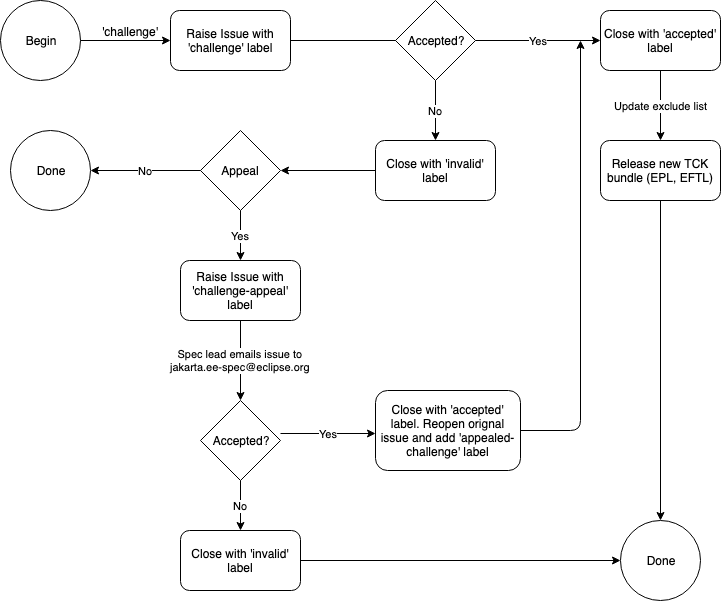

Specification Projects under the Eclipse Foundation Specification
Process MUST produce a Technology Compatibility Kit (TCK) that delivers
on the promise of enabling multiple compatible implementations.

This document defines:

-   Materials a TCK MUST possess to be considered suitable for
    delivering portability

-   Ratifying a Final TCK

-   Process for challenging tests and how these challenges are resolved

-   Means of excluding released TCK tests from certification
    requirements

-   Policy on improving TCK tests for released specifications

-   Process for self-certification

-   Process for (TCK) service release (x.y.z) to resolve a TCK challenge

## Role and Restrictions

It is the role of the TCK to ensure both compatability of
implementations and portability of applications.

TCK tests must be written following all rules and restrictions that
applications must follow including, but not limited to, specification
rules, trademark guidelines and license terms.  Tests that do not
follow these rules and restrictions as they pertain to applications
may be deemed invalid and excluded using the Challenge process.

### Namespace

TCK tests must not be packaged in the `jakarta.*` namespace.  At the
current time TCKs may be packaged in any other namespace, however, the
namespace format of `ee.jakarta.tck.<spec-name>` is recommended.

## Materials for a TCK Release {#_materials_for_a_tck_release}

Artifacts:

-   Projects MUST produce the project licensed (EPL, Apache, etc.)
    version for distribution to Maven Central or other open source
    channels, usable for automated, non-official testing, and
    implementation. No compatibility claims can be made on the basis of
    this TCK.

-   Projects MUST produce a final candidate binary that includes the
    [EFTL](https://www.eclipse.org/legal/tck.php) license. The Jakarta
    EE Specification Committee will sign and promote project TCK binary
    for distribution via Eclipse infrastructure on final approval. This
    is the TCK binary usable for self-certification when one desires to
    make a claim of compatibility, allowing for the use of the Jakarta
    brands.

-   Both TCK binaries MUST contain the following

    -   User guide outlining

        -   Software requirements

        -   Installation and configuration

        -   How to run the tests

        -   Where to file challenges

        -   TCK specific rules not covered in this process guide

    -   Instructions describing how to run the compatible
        implementation(s) that are being used to validate the TCK

    -   A top-level README document pointing to each of the preceding
        documents

-   We recommend that the TCK documentation include

    -   URLs for the issue trackers to file certification requests, bug
        reports, etc.

    -   A statement that the [Certification of
        Compatibility](#_certification_of_compatibility) process must be
        followed before a claim of compatibility can be made.

-   TCK binaries MAY contain

    -   Test coverage document

    -   Test assertion document

-   Release available via a release on project GitHub releases page(or
    equivalent)

    -   Final releases under the EFTL MUST be hosted on
        [download.eclipse.org](http://download.eclipse.org)

### Ratifying a Final TCK {#_ratifying_a_final_tck}

-   Projects will submit the EFTL proposed final binary of the TCK for
    approval to the Specification Committee.

-   The Specification Committee will vote to approve or reject the TCK
    binary.

-   Approved binaries will be signed with the GPG key of the Jakarta
    Specification Committee, and then published on download.eclipse.org
    along with the digital signature of the SHA-256 hash of the final
    binary, and the SHA-256 hash of the binary as the fingerprint of the
    TCK.

-   Consumers can use the GPG key of the Jakarta Specification Committee
    to verify the authenticity of that or any TCK binary.

## Challenges {#_challenges}

Specifications are the sole source of truth and considered overruling to
the TCK in all senses. In the course of implementing a specification and
attempting to pass the TCK, implementations may come to the conclusion
that one or more tests or assertions do not conform to the
specification, and therefore MUST be excluded from the certification
requirements.

Requests for tests to be excluded are referred to as Challenges. This
section identifies who can make challenges to the TCK, what challenges
to the TCK may be submitted, how these challenges are submitted, how and
to whom challenges are addressed.

### Who can file a challenge? {#_who_can_file_a_challenge}

Any implementor may submit a challenge to one or more tests in the TCK
as it relates to their implementation. Implementor means the entity as a
whole in charge of producing the final certified release. **Challenges
filed MUST represent the consensus of that entity.**

### Valid Challenges {#_valid_challenges}

Any test case (e.g., test class, \@Test method), test case configuration
(e.g., deployment descriptor), test beans, annotations, and other
resources considered part of the TCK may be challenged.

The following scenarios are considered in scope for test challenges:

-   Claims that a test assertion conflicts with the specification.

-   Claims that a test asserts requirements over and above that of the
    specification.

-   Claims that an assertion of the specification is not sufficiently
    implementable.

-   Claims that a test is not portable or depends on a particular
    implementation.

### Invalid Challenges {#_invalid_challenges}

The following scenarios are considered out of scope for test challenges
and will be immediately closed if filed:

-   Challenging an implementation's claim of passing a test.
    Certification is an honor system and these issues MUST be raised
    directly with the implementation.

-   Challenging the usefulness of a specification requirement. The
    challenge process cannot be used to bypass the specification process
    and raise in question the need or relevance of a specification
    requirement.

-   Claims the TCK is inadequate or missing assertions required by the
    specification. See the Improvement section, which is outside the
    scope of test challenges.

-   Challenges that do not represent a consensus of the implementing
    community will be closed. If agreement is later reached by the
    implementing community, the issue can be reopened. The test
    challenge process is not the place for implementations to initiate
    their own internal discussions.

-   Challenges to tests that are already excluded for any reason.

-   Challenges that an excluded test should not have been excluded and
    SHOULD be re-added MUST be opened as a new enhancement request

### Filing a Challenge {#_filing_a_challenge}

Challenges MUST be filed via the specification project's issue tracker
using the label `challenge` and include the following information:

-   The relevant specification version and section number(s)

-   The coordinates of the challenged test(s)

-   The exact TCK version

-   The implementation being tested, including name and company

-   A full description of why the test is invalid and what the correct
    behavior is believed to be

-   Any supporting material; debug logs, test output, test logs, run
    scripts, etc.

### Challenge Resolution {#_challenge_resolution}

Challenges can be resolved by a specification project lead, or a project
challenge triage team, after a consensus of the specification project
committers is reached or attempts to gain consensus fails. Specification
projects may exercise lazy consensus, voting or any practice that
follows the principles of [Eclipse Foundation Development
Process](https://www.eclipse.org/projects/dev_process/).

#### Active Resolution {#_active_resolution}

The failure to resolve a Challenge might prevent an implementation from
going to market; Challenges SHOULD be given a high priority by the
specification project and resolved in a timely manner. Two weeks or less
SHOULD be considered the ideal period of time to resolve a challenge.
Challenges may go longer as needed, but as a rule SHOULD avoid months.

If consensus cannot be reached by the specification project for a
prolonged period of time, the default recommendation is to exclude the
tests and address the dispute in a future revision of the specification.

#### Accepted Challenges {#_accepted_challenges}

A consensus that a test produces invalid results will result in the
exclusion of that test from certification requirements, and an immediate
update and release of an official distribution of the TCK including the
new exclude list. The associated `challenge` issue MUST be closed with
an `accepted` label to indicate it has been resolved.

The specification project may approve (user) workarounds for an `accepted` TCK challenge (as an alternative to excluding TCK tests).

As another alternative to excluding a challenged test, it may be possible 
to adjust the test validation logic to "expand" the validation check. 
E.g. if a test expects a value "A1" for a specific variable "x", but a challenge
is raised arguing that the specification language actually allows for either
values "A1" and "A2" (but no other values) to be valid values for "x", then
it could be a valid course of action to modify the challenged test to allow 
either "A1" OR "A2" for "x". 

Since this line of thinking might be applied to cases that aren't quite as 
straightfoward as this example, care should be taken when using this approach.
A particular danger is that an implementation that has already demonstrated compliance 
before the challenge was raised might actually not pass the new, modified test.

To limit the confusion and additional work such a scenario would cause, if 
there is already at least one certified compatible implementation before the challenge,
the new, modified TCK should be run against at least one such implementation (and ideally all of them)
before the changes are published, released, and finalized.

If such a change were released, and it was later found to cause a previously-certified implementation
to fail the new, modified test, then excluding the test would likely be the only option, and this would
require yet another, additional service release.

#### Rejected Challenges and Remedy {#_rejected_challenges_and_remedy}

When a `challenge` issue is rejected, it MUST be closed with a label of
`invalid` to indicate it has been rejected. The appeal process for
challenges rejected on technical terms is outlined in Escalation Appeal.
If, however, an implementer feels the TCK challenge process was not
followed, an appeal issue MUST be filed with the specification project's
issue tracker using the label `challenge-appeal`. A project lead MUST
escalate the issue with the Jakarta EE Specification Committee via email
(<jakarta.ee-spec@eclipse.org>). The committee will evaluate the matter
purely in terms of due process. If the appeal is accepted, the original
TCK challenge issue will be reopened and a label of `appealed-challenge`
added, along with a discussion of the appeal decision, and the
`challenge-appeal` issue with be closed. If the appeal is rejected, the
`challenge-appeal` issue MUST be closed with a label of `invalid`.

## Excludes {#_excludes}

Excludes MUST be included in the TCK project release in a format that is
compatible with the testing framework in use so that as the excludes are
updated, the affected tests are automatically removed from the test
suite.

###  Adding excluded tests
Excluded tests should be added back in for every major Jakarta EE release by emptying the test exclude list for every Specification developed in the respective major EE release.   

## Improvement {#_improvement}

Requests for improvement to tests MUST simply be created as issues with
a label of `enhancement` in the specification project's TCK issue
tracker.

## Certification of Compatibility {#_certification_of_compatibility}

Jakarta EE is a self-certification ecosystem. If you wish to have your
implementation listed on the official [jarkarta.ee](https://jakarta.ee)
implementations page for the given specification, a certification
request as defined in this section is required.

There are additional requirements that MUST be met by any organization
wishing to use the Jakarta EE logo or [jarkarta.ee](https://jakarta.ee)
website for promotion. Any request for certification from an
organization not meeting the requirements will be held until such time
as the requirements are met. See the [Jakarta EE Trademark
Guidelines](https://jakarta.ee/legal/trademark_guidelines/) for more
information on the complete steps to obtain Jakarta EE branding usage.

An approved certification request is a statement from the Specification
Project you have met the intended TCK requirements and is just one of
the requirements for logo usage. Logos only apply to platform and
profile specifications, but a request to be listed as a compatible
implementation can be made for any specification.

### Filing a Certification Request {#_filing_a_certification_request}

Requests to be acknowledged as a certified implementation MUST be filed
via the specification project's issue tracker using the label
`certification` and include the following information:

-   Statement of Acceptance of the terms of the EFTL

-   Product Name, Version and download URL (if applicable)

-   Specification Name, Version and download URL

-   TCK Version, digital SHA-256 fingerprint and download URL

-   Implementation runtime Version(s) tested

-   Public URL of TCK Results Summary

-   Any Additional Specification Certification Requirements

-   Java runtime used to run the implementation

-   Summary of the information for the certification environment,
    operating system, cloud, ...​

-   A statement attesting that all TCK requirements have been met,
    including any compatibility rules

### Additional Specification Certification Requirements {#_additional_specification_certification_requirements}

Specification projects may require additional items for a Certification
Request as defined in their corresponding TCK Documentation under the
section labeled \"Additional Certification Requirements\".

Examples of such additional requirements may include:

-   Name and version of Compatible Implementation used for
    interoperability tests

-   Name and version of Databases used for persistence tests

-   Name and version of NoSQL implementations used in persistence tests

### Public TCK Results Summary {#_public_tck_results_summary}

While certification is on your honor, the community MUST be able to see
your test results summary. At a minimum a results summary MUST:

-   Be publicly visible with no password protection or sign-up

-   Include a Summary Page containing:

    -   All information in the above Certification Request

    -   The Total number of tests run and passed. If you are running a
        platform TCK, this means reporting the tests run for each
        required TCK, which includes the platform TCK and some of the
        individual TCKs that are not integrated with the platform TCK.

An optional "Test List Page" showing all tests run may be linked from
the Summary Page. The Summary Page URL is the URL that MUST be included
in any Certification Requests.

The following are explicitly not requirements:

-   The Ability for the public to run the tests themselves

-   Full log output of the TCK

Implementors may supply this information and provide support for how to
run a TCK against their implementation, but it is not required.

### Certification Resolution {#_certification_resolution}

As noted, certification requests do not in themselves grant rights to
use the Jakarta EE logo. Approval that the TCK requirements have been
met is a prerequisite for obtaining Jakarta EE logo usage for profile
certification. The required approval processes is:

-   Approval by lazy consensus after a period of two weeks (14 days)

-   Approval by a majority vote of the specification project as soon as
    it happens.

    -   The sum of the +1/-1 votes must be greater than 50% of the
        specification project committers.

-   Approval by any top-level specification project lead at any time

All specification project members are encouraged to review the request
and associated supporting materials. Reviewers of a certification
request MUST carefully check the validity of all required data, in
particular:

-   the data is complete

-   the number of tests passed is consistent with the first
    implementation used to validate the TCK

-   TCK version and digital fingerprint match.

-   test results are public and do not require special signup or viewing
    steps

Any committer on the specification project may vote against the
certification request on the basis that the clearly defined requirements
of the TCK process have not been met. This means that if there is a (-1)
vote, lazy consensus is no longer an option and a majority vote MUST
take place.

#### Accepted Certification Requests {#_accepted_certification_requests}

Certification requests that are reviewed and found to meet the
requirements will be marked accepted by closing an issue with an
`accepted` label. A pointer/link to the issue MUST then be emailed to
\[<tck@eclipse.org>\](mailto:tck\@eclipse.org), as required by the
\[Eclipse Foundation Technology Compatibility Kit
License\](<https://www.eclipse.org/legal/tck.php>). If use of the
Jakarta EE logo or trademark is being requested (currently only
applicable to platform or profile products), see the \[Jakarta EE
Trademark
Guidelines\](<https://jakarta.ee/legal/trademark_guidelines/>).

#### Rejected Certification Requests {#_rejected_certification_requests}

Certification requests that are reviewed and found to NOT meet the
requirements will be marked as such by closing an issue with an
`invalid` label along with the requirements that were not met. A new
certification issue MUST be created with the updated requirements to
attempt the certification request again.

### Escalation Appeal {#_escalation_appeal}

If there is a concern that a TCK process issue has not been resolved
satisfactorily, the Eclipse Development Process [Grievance
Handling](https://www.eclipse.org/projects/dev_process/#6_5_Grievance_Handling)
procedure SHOULD be followed to escalate the resolution. Note that this
is not a mechanism to attempt to handle implementation specific issues.

### How Tests May be Added or Changed in a TCK {#_how_tests_may_be_added_or_changed_in_a_tck}

Tests may be added, updated, removed or excluded as the specification team sees fit in major or minor updates.

In service releases, specification teams should only make changes that are documented in TCK challenge issues, and 
service release notes should document which challenges have been addressed. Test updates within a service release
should follow the guidance described under Accepted Challenges.

## Process for releasing a point revision of a TCK

The process for releasing a point revision of a TCK entails filing an issue in the [jakartaee/specifications repository with the following details](https://github.com/jakartaee/specifications):

-   Link to the TCK release to be published.
-   Updated TCK links in the specification's _index.md file.
-   A high-level description of what tests were excluded from the TCK and why.
