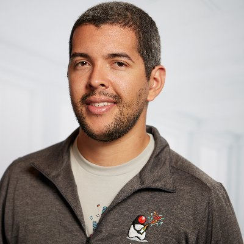
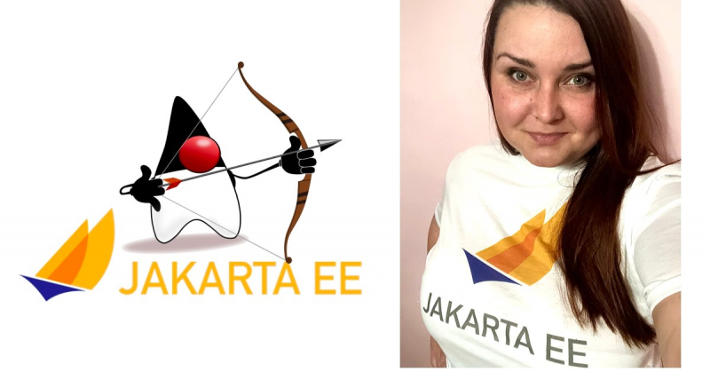

The Eclipse Foundation provides our global community of individuals and organizations with a mature, scalable, and business-friendly environment for open source software collaboration and innovation. The Foundation is home to the [Jakarta EE](https://jakarta.ee/), [MicroProfile](https://microprofile.io/), Eclipse IDE, and over 350 open source projects.

The Eclipse Foundation is an international not-for-profit association supported by over 300 [members](https://www.eclipse.org/membership) who value the Foundation’s unique [Working Group](https://www.eclipse.org/org/workinggroups/) governance model, open innovation processes, and community-building events. Members include industry leaders who have embraced open source as a key enabler for business strategy.

The newest members of the Eclipse Foundation’s Jakarta EE Marketing and Branding committee are [Otavio Santana](https://twitter.com/otaviojava) and [Tetiana Fydorenchyk](https://twitter.com/tetiana_ftv). 

Otavio is a software engineer focused on Cloud and Java technology. He has experience mainly in persistence polyglot and high-performance applications in finances, social media, and e-commerce. He is a member of both Expert Groups and Expert Leader in several JSRs and JCP executive committee and he is working on several Apache and Eclipse Foundation projects such as Apache Tamaya, MicroProfile, Jakarta EE, where he is leading the first specification at Jakarta EE with Jakarta NoSQL. A JUG leader and global speaker at JavaOne and Devoxx conferences, Otavio has received recognition for his OSS contributions such as the JCP Outstanding Award, Member of the year and innovative JSR, Duke’s Choice Award, and Java Champion Award, to name a few. He is a developer relations engineer at [Platform.sh](https://platform.sh/), a platform built especially for agile development and continuous deployment. 

Otavio says, “I’m pleased to be part of the Jakarta EE Marketing and Branding Committee and help in shaping the strategy for our whole community to promote, share, engage with events about technology and bring even more visibility to the progress we’re making. This community is unique and will be a powerful force for the future of technology development because of the collaborative approach that drives us - where everybody can cooperate, help, and share their knowledge to create a community of success around Jakarta EE”

Otavio will also contribute Platform.sh's know-how, which has helped thousands of companies in the cloud adoption globally, the goal is to bring even more maturity and credibility with [guides](https://docs.platform.sh/guides.html), [templates](https://docs.platform.sh/development/templates.html#java), and cases, indeed, in the Java/Jakarta EE side as well. Furthermore, Platform.sh has a [community sponsorship program](https://docs.google.com/document/d/1yXrjk4obCOaRThqUiL0h3llOldOHbGVXAyYYHEFjcko/edit#heading=h.fgys9p2kbv6) to help the community and the open-source.

Tetiana Fydorenchyk is Vice President of Marketing at [Jelastic](https://jelastic.com/), a multi-cloud PaaS provider serving developers and hosting companies around the world. The company twice got [Duke’s Choice Award](https://jelastic.com/blog/duke-choice-award-2018-winner/) for its contribution to Java enhancement and cloud adoption. Tetiana provides executive leadership and management of Jelastic inbound and out-bound marketing activities worldwide, including: corporate, partner/channel, content and product marketing. She produces [articles](https://jelastic.com/blog/) on tech and business topics related to cloud computing, containers, DevOps, microservices, multi-cloud and others. Also, currently Tetiana is a member of Jakarta EE and Microprofile Working Groups.

Tetiana collaborates with leaders in the Java community and cloud customers on a daily basis. She develops blogs, arranges conferences, webinars, user groups meetups and other events designed to support the Java community in its growth and innovation. She has expertise in content creation, online events, public relations and social media, and looks forward to using these skills on behalf of the Jakarta EE project.

Tetiana says, “I’m thrilled to be part of the Jakarta EE Marketing Committee and leverage my network and marketing communications to help this exciting initiative. The main purpose is to accelerate and sustain the growth of the Jakarta EE community by making a valuable practical contribution such as spreading the word, creating content, participating in the events and collaborating on the future plans.”

 

Please stay up-to-date on the latest news and developments from the dynamic Jakarta EE community on Twitter, Facebook and our LinkedIn Group. 